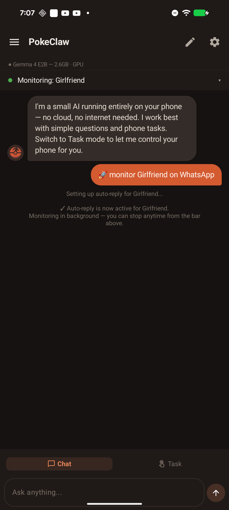
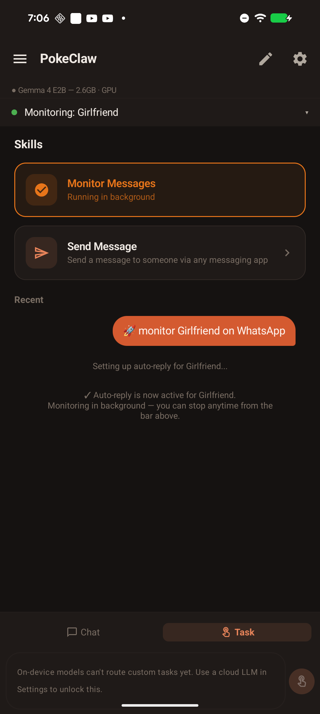
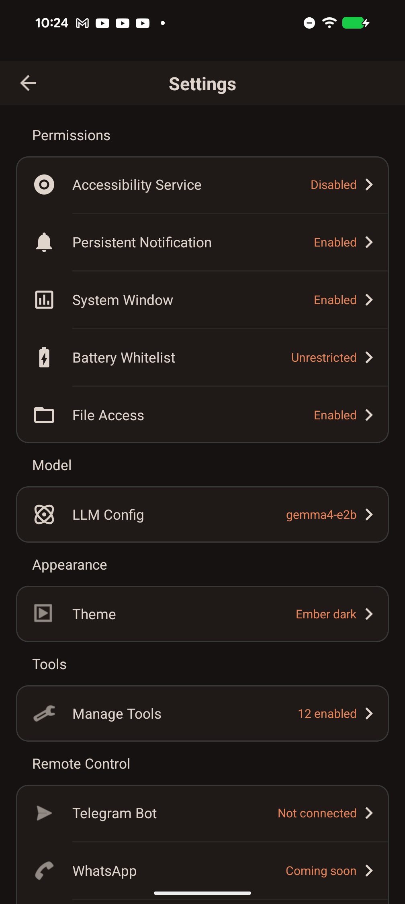

  

  

# PokeClaw

https://github.com/user-attachments/assets/c713e227-7581-4475-acd4-0480128c8ec8

https://github.com/user-attachments/assets/18d49148-c744-46a5-98a2-0f8320f00d19

> **Why is the "hi" demo slow?** This was recorded on a budget Android phone with CPU-only inference (no GPU, no NPU). Running Gemma 4 E2B on CPU takes ~45 seconds to warm up (down from several minutes — we optimized the engine initialization and session handoff architecture to get it this low). If your phone has a GPU-capable chip, it's **significantly faster**:
> - **Google Tensor G3/G4** (Pixel 8, Pixel 9)
> - **Snapdragon 8 Gen 2/3** (Galaxy S24, OnePlus 12)
> - **Dimensity 9200/9300** (recent MediaTek flagships)
> - **Snapdragon 7+ Gen 2+** (mid-range with GPU)
>
> On these devices, warmup drops to seconds. Same model, better hardware.
>
> That said, the fact that a 2.3B model can autonomously control a phone running purely on CPU is already pretty impressive. GPU just makes it faster.

Your phone, on autopilot. No cloud, no API keys, no data leaving your device.

PokeClaw runs Gemma 4 (2.3B) entirely on your Android phone and controls it through accessibility. Tell it what to do in plain language, it figures out the taps, swipes, and typing.

## The Story

I'm a solo developer. When Gemma 4 dropped on April 2nd with native tool calling on LiteRT-LM, I pulled two all-nighters and built this from scratch. This is the first local LLM that can run on a phone and is capable enough to handle genuinely complex tasks — having conversations, auto-replying to your mom based on context, navigating apps autonomously. That's exciting to me.

It's not perfect. Local LLMs are not as smart as cloud models, and there are plenty of rough edges. Hardware is what it is — we can't make your CPU faster. But on the software side, we're actively improving the architecture, the tool system, and the overall design. Cloud LLM support is coming as an optional feature for people who want more power.

And it's **completely free**. No API keys that bill you every month. No subscription. No usage limits. The model runs on your hardware and costs you nothing.

We're living through a historic shift. Local LLMs are now smart enough to actually do useful work on a phone. That wasn't true 6 months ago. On-device models are getting smarter fast, and we're hoping it won't be long before they close the gap with cloud models entirely. When that happens, PokeClaw is ready.

**This project has a lot of issues. That's expected. Please [open them](https://github.com/agents-io/PokeClaw/issues).** Every bug report makes this better.

## Screenshots

  
  
  
  

## What it does

The model picks the right tool, fills in the parameters, and executes. You don't configure anything per-app. It just reads the screen and acts.

## How it works

PokeClaw gives a small on-device LLM a set of tools (tap, swipe, type, open app, send message, enable auto-reply, etc.) and lets it decide what to do. The LLM sees a text representation of the current screen, picks an action, sees the result, picks the next action, until the task is done.

Everything runs locally via [LiteRT-LM](https://ai.google.dev/edge/litert/llm/overview) with native tool calling. The model never phones home.

## Tools

The LLM has access to these tools and picks them autonomously:

| Tool | What it does |
|------|-------------|
| `tap` / `swipe` / `long_press` | Touch the screen |
| `input_text` | Type into any text field |
| `open_app` | Launch any installed app |
| `send_message` | Full messaging flow: open app, find contact, type, send |
| `auto_reply` | Monitor a contact and reply automatically using LLM |
| `get_screen_info` | Read current UI tree |
| `take_screenshot` | Capture screen |
| `finish` | Signal task completion |

## Download

[**Download APK (v0.1.0)**](https://github.com/agents-io/PokeClaw/releases/latest)

Android 9+, arm64. No root required.

## Quick start

1. Install the APK
2. Grant accessibility permission when prompted
3. The model downloads automatically on first launch (~2.6 GB)
4. Switch to Task mode, type what you want

No API keys. No cloud config. No account.

## License

Apache 2.0

Contributors sign our CLA before their first PR is merged.
