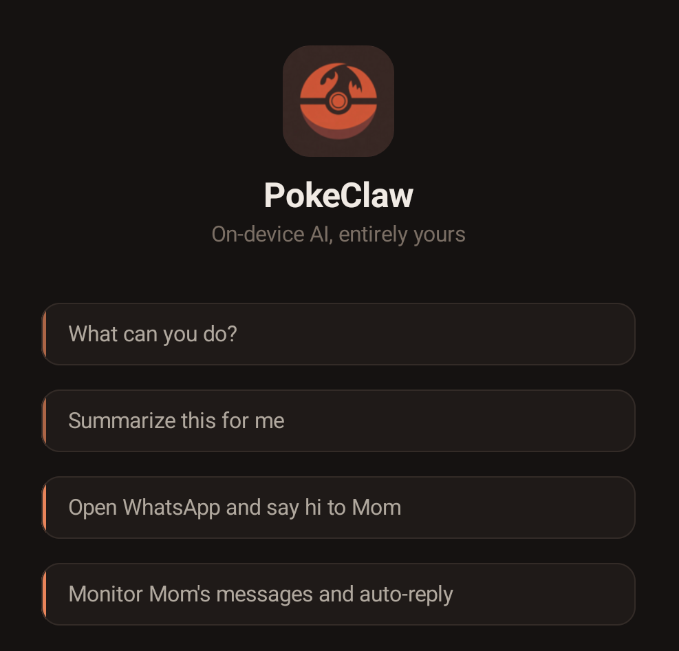

  

# PokeClaw

https://github.com/user-attachments/assets/c713e227-7581-4475-acd4-0480128c8ec8

https://github.com/user-attachments/assets/18d49148-c744-46a5-98a2-0f8320f00d19

Your phone, on autopilot. No cloud, no API keys, no data leaving your device.

PokeClaw runs Gemma 4 (2.3B) entirely on your Android phone and controls it through accessibility. Tell it what to do in plain language, it figures out the taps, swipes, and typing.

## Screenshots

  
  
  
  

## What it does

The model picks the right tool, fills in the parameters, and executes. You don't configure anything per-app. It just reads the screen and acts.

## How it works

PokeClaw gives a small on-device LLM a set of tools (tap, swipe, type, open app, send message, enable auto-reply, etc.) and lets it decide what to do. The LLM sees a text representation of the current screen, picks an action, sees the result, picks the next action, until the task is done.

Everything runs locally via [LiteRT-LM](https://ai.google.dev/edge/litert/llm/overview) with native tool calling. The model never phones home.

## Tools

The LLM has access to these tools and picks them autonomously:

| Tool | What it does |
|------|-------------|
| `tap` / `swipe` / `long_press` | Touch the screen |
| `input_text` | Type into any text field |
| `open_app` | Launch any installed app |
| `send_message` | Full messaging flow: open app, find contact, type, send |
| `auto_reply` | Monitor a contact and reply automatically using LLM |
| `get_screen_info` | Read current UI tree |
| `take_screenshot` | Capture screen |
| `finish` | Signal task completion |

## Download

[**Download APK (v0.1.0)**](https://github.com/agents-io/PokeClaw/releases/latest)

Android 9+, arm64. No root required.

## Quick start

1. Install the APK
2. Grant accessibility permission when prompted
3. The model downloads automatically on first launch (~2.6 GB)
4. Switch to Task mode, type what you want

No API keys. No cloud config. No account.

## License

Apache 2.0

Contributors sign our CLA before their first PR is merged.
